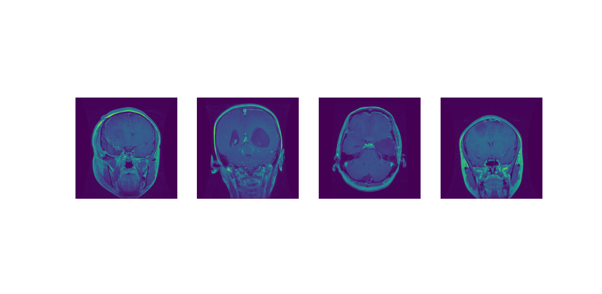
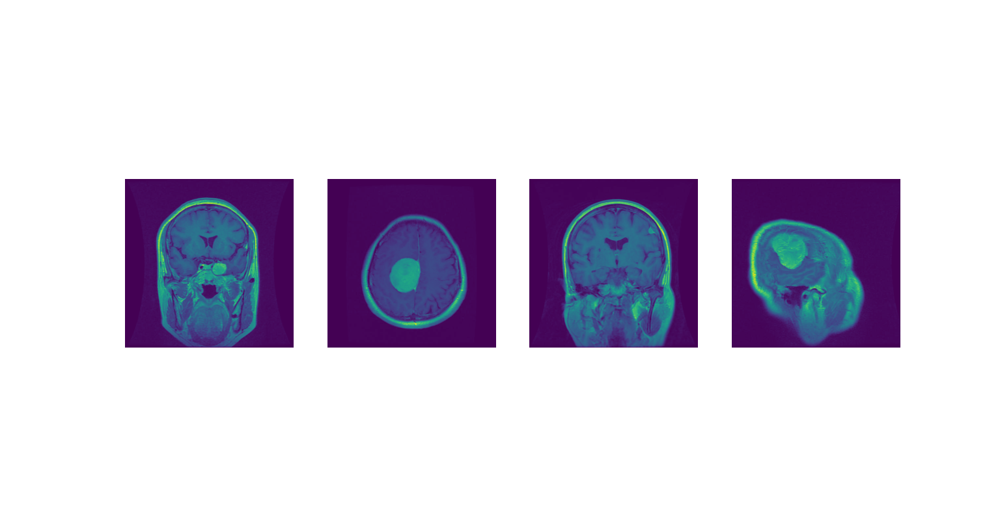
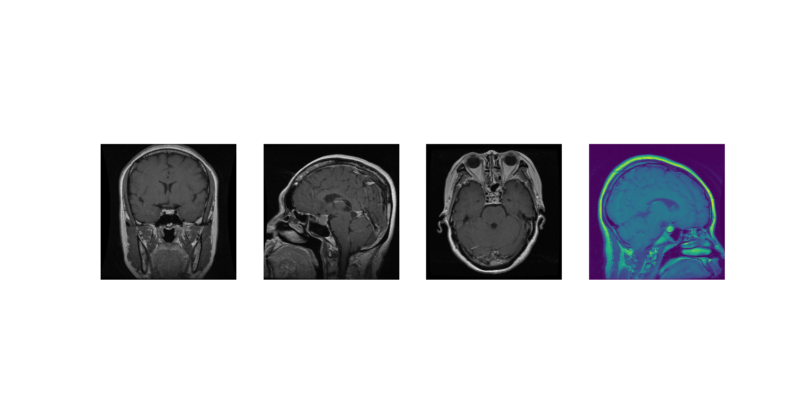
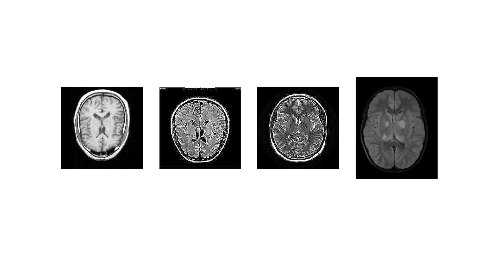
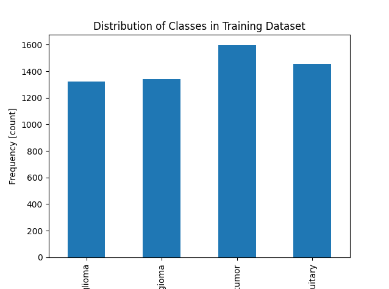
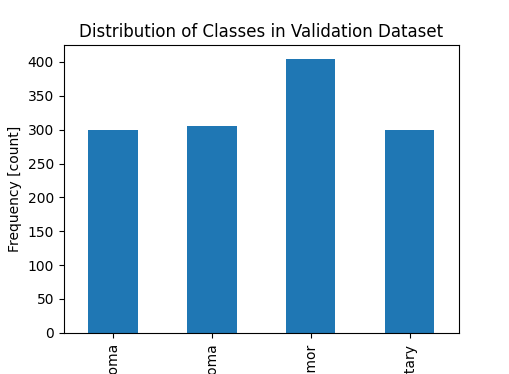

# Table of Contents

1. [Dataset Description](#dataset-description-and-cleaning)
2. [EDA (Exploratory Data Analysis)](#eda-exploratory-data-analysis)

## Dataset Description and Cleaning

Dataset URL: [Kaggle - Brain Tumor MRI Dataset]([https://www.kaggle.com/datasets/mrsimple07/energy-consumption-prediction/data](https://www.kaggle.com/datasets/masoudnickparvar/brain-tumor-mri-dataset/data))

The dataset contains MRI brain scan images categorized into four classes, glioma tumor, meningioma tumor, pituitary tumor and no tumor. The dataset is divided into two parts, the trainig with 5712 images and the testing with 1311 images.

Each class has its own subfolder in the directory structure. The dataset includes images with varying resolutions, aspect ratios, and color formats so we cleaned and standardized the data using the following preprocessing:

- RGB Conversion: To standardize the different color modes all images were converted to RGB.

- Resizing: All images were resized to 224 × 224 pixels.

- Tensor Conversion: The image is converted into a PyTorch tensor using transforms.ToTensor().

- Normalization: We normalized the dataset using the channel wise mean and standard deviation.

## EDA (Exploratory Data Analysis)

We began the EDA by visualizing a few random MRI images from each class (glioma, meningioma, pituitary, and no tumor) to get an idea of the dataset's visual structure and quality.

Glioma:

Meningioma:

Pituitary:

No tumor:

We also analyzed the class balance in both the training and testing datasets. This is important because a highly imbalanced dataset can bias the model toward predicting the majority class.

The plots below show the number of images per class in each dataset:

Training Set Distribution:

As shown in the chart, while the dataset is relatively balanced, the "no tumor" class has slightly more samples than the others. Though not severely skewed, this minor imbalance can still affect model training and evaluation but not on a really meaningful way.

Validation Set Distribution:

The validation dataset follows a similar pattern, with "no tumor" having more samples than the tumor classes. While the imbalance is not extreme, it’s important to keep this in mind during training and evaluation to avoid bias in model predictions.

