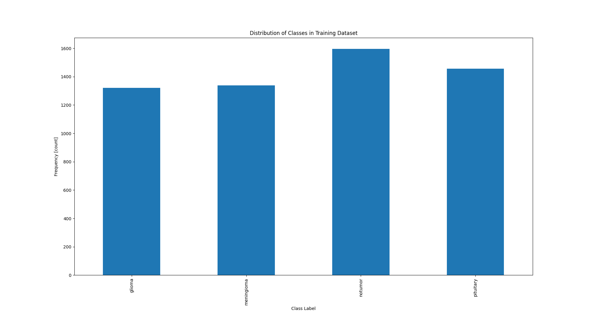

# Table of Contents

1. [Dataset Description](#dataset-description-and-cleaning)
2. [EDA (Exploratory Data Analysis)](#eda-exploratory-data-analysis)
3. [Model Training](#model-training)

## Dataset Description and Cleaning

Dataset URL: [Kaggle - Brain Tumor MRI Dataset]([https://www.kaggle.com/datasets/mrsimple07/energy-consumption-prediction/data](https://www.kaggle.com/datasets/masoudnickparvar/brain-tumor-mri-dataset/data))

The dataset contains MRI brain scan images categorized into four classes, glioma tumor, meningioma tumor, pituitary tumor and no tumor. The dataset is divided into two parts, the trainig with 5712 images and the testing with 1311 images.

Each class has its own subfolder in the directory structure. The dataset includes images with varying resolutions, aspect ratios, and color formats so we cleaned and standardized the data using the following preprocessing:

- RGB Conversion: To standardize the different color modes all images were converted to RGB.

- Resizing: All images were resized to 224 × 224 pixels.

- Tensor Conversion: The image is converted into a PyTorch tensor using transforms.ToTensor().

- Normalization: We normalized the dataset using the channel wise mean and standard deviation.

## EDA (Exploratory Data Analysis)

We began the EDA by visualizing a few random MRI images from each class (glioma, meningioma, pituitary, and no tumor) to get an idea of the dataset's visual structure and quality.

Glioma:

Meningioma:

Pituitary:

No tumor:

We also analyzed the class balance in both the training and testing datasets. This is important because a highly imbalanced dataset can bias the model toward predicting the majority class.

The plots below show the number of images per class in each dataset:

Training Set Distribution:

As shown in the chart, while the dataset is relatively balanced, the "no tumor" class has slightly more samples than the others. Though not severely skewed, this minor imbalance can still affect model training and evaluation but not on a really meaningful way.

Validation Set Distribution:

The validation dataset follows a similar pattern, with "no tumor" having more samples than the tumor classes. While the imbalance is not extreme, it’s important to keep this in mind during training and evaluation to avoid bias in model predictions.

## Model Training

We implemented a Convolutional Neural Network (CNN) using PyTorch to classify brain MRI images into four categories: glioma, meningioma, pituitary, and no tumor.
The CNN consists of three convolutional blocks followed by a fully connected classifier:

- Conv Layer 1: 64 filters, kernel size 3x3, ReLU activation, followed by 2x2 MaxPooling
- Conv Layer 2: 32 filters, kernel size 3x3, ReLU activation, followed by 2x2 MaxPooling
- Conv Layer 3: 16 filters, kernel size 3x3, ReLU activation, followed by 2x2 MaxPooling

After the convolutional blocks, the feature maps are flattened and passed through three fully connected layers: the first goes from 12544 to 64 units, the second from 64 to 32, and the final layer outputs 4 logits corresponding to the classes.

For training, we used the CrossEntropyLoss function, which is suitable for multi-class classification. The optimizer chosen was Adam with a learning rate of 0.001. A StepLR scheduler was used to reduce the learning rate by a factor of 0.1 every 10 epochs to improve performance during the later stages of training. We trained the model with a batch size of 32 for 20 epochs.

To improve training efficiency and avoid overfitting, we incorporated model checkpointing and early stopping. The model is saved whenever the validation loss reaches a new minimum. Additionally, if the validation loss does not improve for five consecutive epochs, the training process is stopped early.

Throughout the training, accuracy and loss are monitored on both the training and validation datasets. These metrics help assess the model's performance and ensure it is learning appropriately. The implementation is modular, making it easy to modify the architecture, hyperparameters, or dataset setup.

Below are the training and validation results from the first five epochs:
| Epoch         |	Training Loss | Training accuracy | Validation loss |  Validation accurac                                                 
|-----------------|-------------------|----------------|-------------------|-------------------|
|1  | 0.3972 | 83.5021% | 0.5090 |  77.6677%  |
|2  | 0.2174 | 91.5852% | 0.3436 |  85.9756%  |
|3  | 0.1181 | 96.3513% | 0.2170 |  92.0732%  |
|4  | 0.1003 | 96.2116% | 0.2001 |  92.3018%  |
|5  | 0.0659 | 98.0622% | 0.1816 |  93.2927%  |

